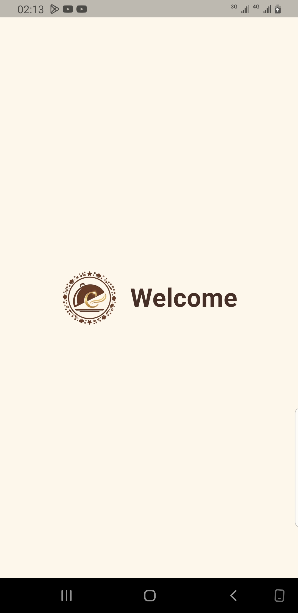
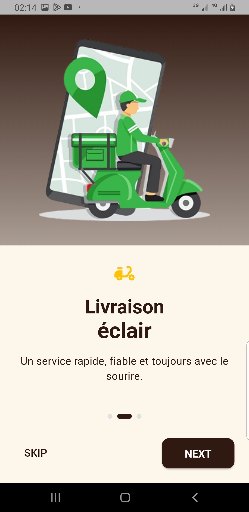
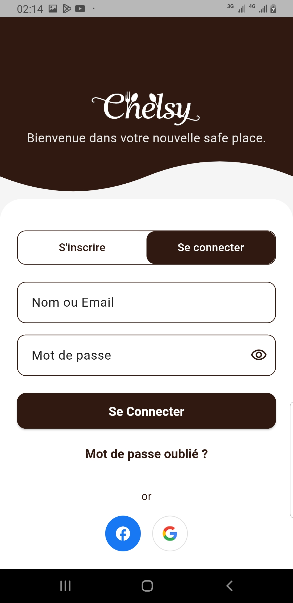
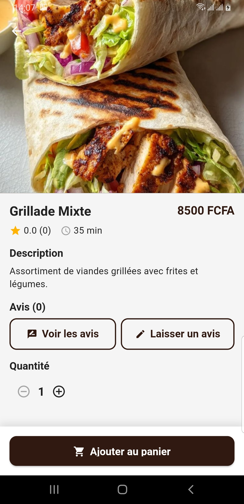
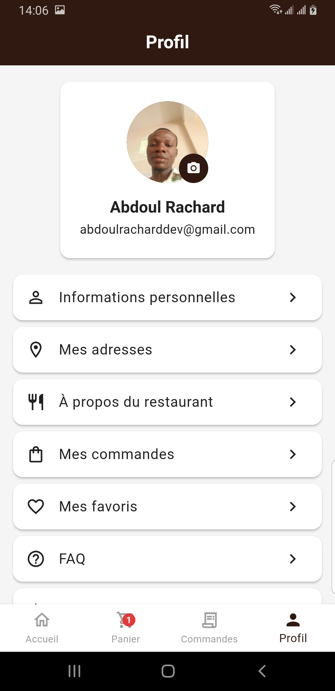

# CHELSY Restaurant

**Application mobile restaurant** — Parcours complet : carte, panier, commande et paiement (Stripe, Mobile Money, espèces).

## Aperçu

CHELSY Restaurant est l’application mobile du projet. Elle permet de parcourir la carte (catégories et plats), gérer le panier, passer commande et payer (carte, Mobile Money, espèces) sans quitter l’app.

- **Backend** : API Laravel — [Documentation](https://chelsy-api.cabinet-xaviertermeau.com/api/documentation)

## Captures d’écran

 Splash · Onboarding · Connexion · Accueil

| | | | |
|:---:|:---:|:---:|:---:|
|  |  |  |  |

 Carte · Détail plat · Panier · Commandes · Profil

| | | | | |
|:---:|:---:|:---:|:---:|:---:|
|  |  |  |  |  |

## Démarrage rapide

```bash
git clone https://github.com/iamrachking/chelsy_restaurant.git
cd chelsy_restaurant
flutter pub get
flutter run
```

- **Flutter** : SDK ^3.9.2  
- **Émulateur** : Android Studio ou Xcode ou téléphone

## Stack

- **Flutter** + **GetX** (état & navigation)
- **Dio** (API, Bearer token)
- **SharedPreferences** (token, données utilisateur)
- **Firebase** (notifications push)
- **Cached Network Image** (images)
- **Geolocator / Geocoding** (adresses, livraison)

## Configuration API

- **Production** : `https://chelsy-api.cabinet-xaviertermeau.com/api/v1`
- **Local** : éditer `lib/core/constants/app_constants.dart` (ex. `http://10.0.2.2:8000/api/v1` pour Android).

## Licence

Projet CHELSY Restaurant.
